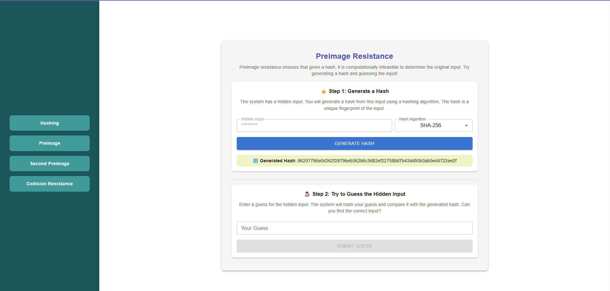

### Procedure
<h5>Hashing</h5>

 click on the hashing button and enter the message  you want to get hashed 

Select the algorithm with which you need to hash the message, such as MD5 or SHA-256. 

Hashed input value is displayed 

<h5>Preimage</h5>

 click on the Preimage button ,Select the algorithm with which you need to hash the message 

Click the "Generate Hash" button to view the hash value generated for the hidden input. 

Step 2: Try to guess the hidden input and click the "Submit" button to check if the hash values match.

 If the generated hash is the same as the previous one, the input has been successfully cracked. However, if the hash values differ, it demonstrates preimage resistance, meaning it is computationally difficult to determine the original input from its hash. 

<h5>SecondPreimage</h5>

 Click the "Second Preimage" button, select an algorithm (MD5, SHA-256, or SHA-512), and view the generated hash value.

 Step 2: Find a Different Input with Same Hash

If the generated hash does not match the previous hash, it demonstrates strong second preimage resistance! Even with knowledge of the original hash, finding another input that produces the same hash is computationally infeasible, ensuring security.

<h5>Collision Resistance</h5>

clicks on the "Collision Resistance" button and select an algorithm (MD5, SHA-256, or SHA-512)

Enter the unknown first message, or click the "Random" button to generate a message automatically. The corresponding hash value will be displayed 

Enter the unknown second message, or click the "Random" button to generate a message automatically. The corresponding hash value will be displayed 

Click the "Check for Collision" button to compare the hash values of two unknown inputs. If the hashes are different, it confirms collision resistance, meaning it is difficult to find two different inputs that produce the same hash. 

