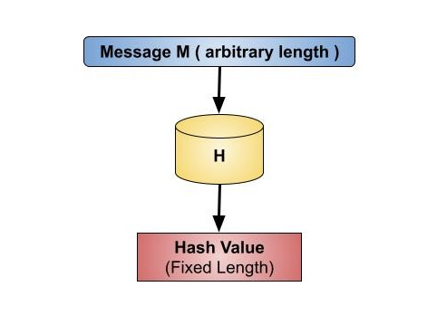
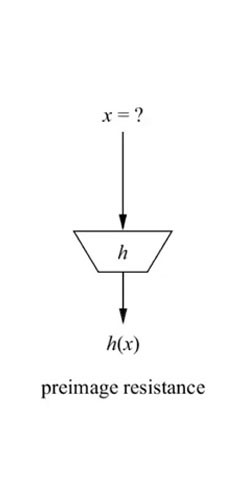
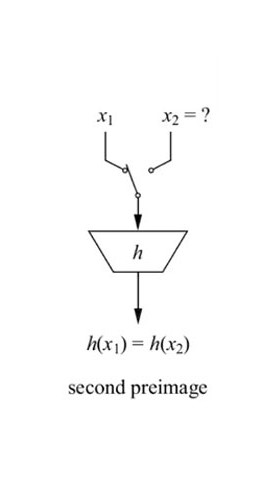
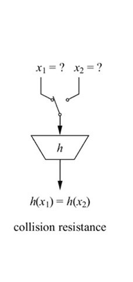

Hash functions play a crucial role in various security applications, including password storage (hash values instead of passwords), digital signatures, and data integrity checks. Hash values, or message digests, are values that a hash function returns. The hash function is shown in the image below:

#### Properties of hash functions

**Pre-Image Resistance**

A cryptographic hash function **h** is preimage resistant if it is **computationally infeasible** to determine the original input **x** given only the hash output **h(x)**. This means that even if **h(x)** is known, finding an **x** such that **h(x)** produces the given output is extremely difficult.

**Second Pre-Image Resistance**

A cryptographic hash function **h** satisfies **second preimage resistance** if:

- Given an input **x₁** and its hash **h(x₁)**, it should be **computationally infeasible** to find another input **x₂** such that **h(x₁) = h(x₂)**.
- In other words, an attacker should not be able to find a different input **x₂** that produces the same hash as **x₁**.
- This property ensures the integrity of digital signatures and stored passwords by preventing intentional collisions.
- Second preimage resistance is crucial in preventing forgery and tampering with hashed data.

**Collision Resistance**

A cryptographic hash function **h** satisfies **collision resistance** if:

- It is **computationally infeasible** to find two different inputs **x₁** and **x₂** such that **h(x₁) = h(x₂)**.
- In other words, no two distinct inputs should produce the same hash value.
- This property ensures the security of digital signatures, certificates, and cryptographic integrity checks by preventing attackers from generating fraudulent data with the same hash.
- Collision resistance is crucial in maintaining the uniqueness of hashes and protecting against deliberate hash collisions.

