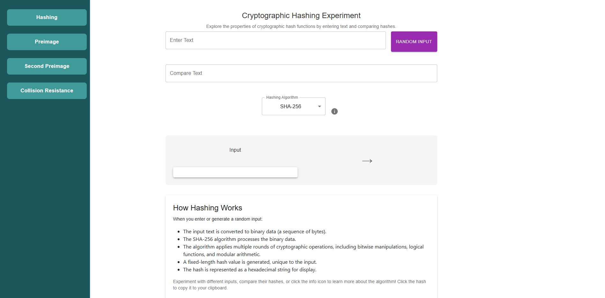
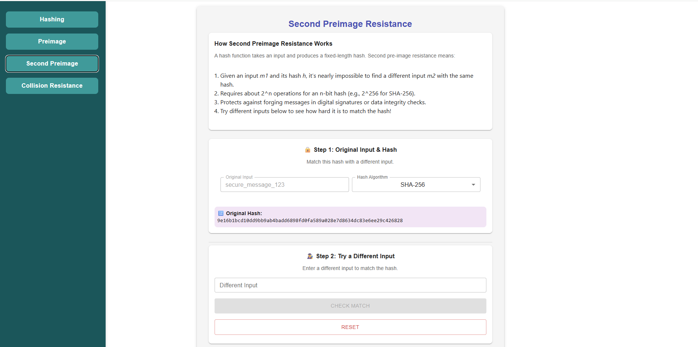
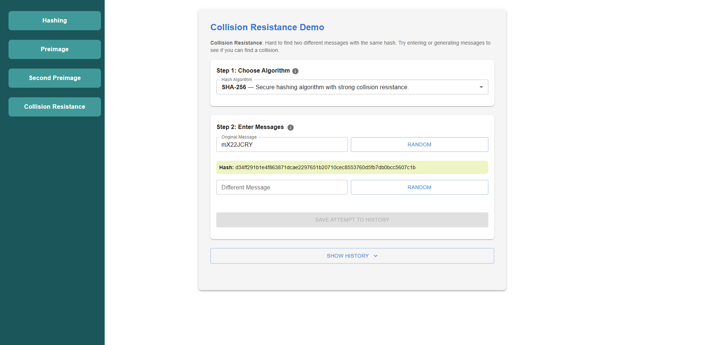

#### Hashing  

1. Click on the **Hashing** button from the left panel.  
2. Enter the text you want to hash in the **Enter Text** input box.  
3. (Optional) Click the **Random Input** button to generate a random message.  
4. Select the hashing algorithm (e.g., **SHA-256**, MD5, etc.) from the dropdown list.  
5. The **hashed value** of the input will be displayed in the output section.  

  

#### Preimage  

1. Click on the **Preimage** button from the left panel.  
2. **Step 1:** A hidden input is hashed using the selected algorithm (e.g., **SHA-256**). Click **Generate Hash** to see the hash value.  
3. **Step 2:** Try to guess the hidden input by entering your guess in the text box.  
4. Click **Submit Guess** to check if your guess produces the same hash.  
5. If the hash matches, the hidden input is correctly guessed. If not, it demonstrates **Preimage Resistance** – showing that it is computationally hard to recover the original input from its hash.  

  

#### Second Preimage  

1. Click on the **Second Preimage** button from the left panel.  
2. **Step 1:** Observe the **Original Input** and its corresponding hash generated using the selected algorithm (e.g., **SHA-256**).  
3. **Step 2:** Enter a **different input** into the text box.  
4. Click **Check Match** to see if the new input produces the same hash.  
5. If the hashes do not match, it demonstrates **Second Preimage Resistance** – meaning it is computationally infeasible to find another input that generates the same hash as the original one.  

  

#### Collision Resistance  

1. Click on the **Collision Resistance** button from the left panel.  
2. **Step 1:** Select the hashing algorithm (e.g., **SHA-256**) from the dropdown.  
3. **Step 2:** Enter the **Original Message** manually or click **Random** to generate one automatically. Its hash will be displayed.  
4. Enter a **Different Message** manually or generate one using **Random**. Its hash will also be displayed.  
5. The system checks if the two hashes are identical:  
   - If the hashes are **different**, it confirms **Collision Resistance**, meaning it is very difficult to find two distinct inputs with the same hash.  
   - If the hashes are the **same** (collision), it would demonstrate a weakness in the algorithm.  

  
